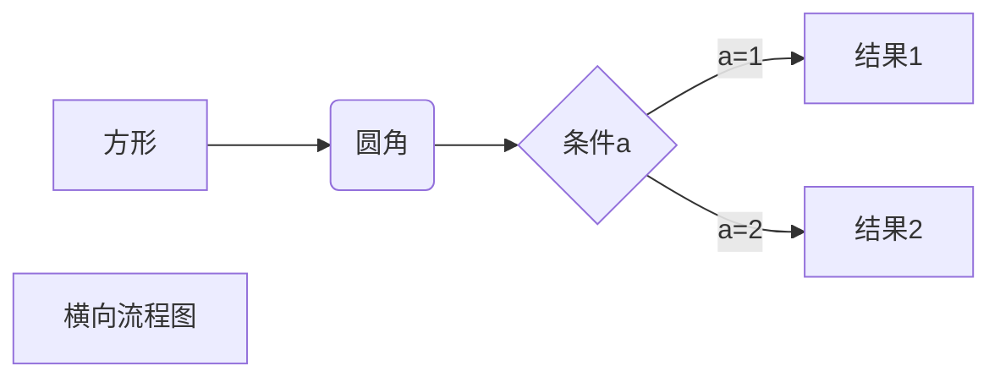
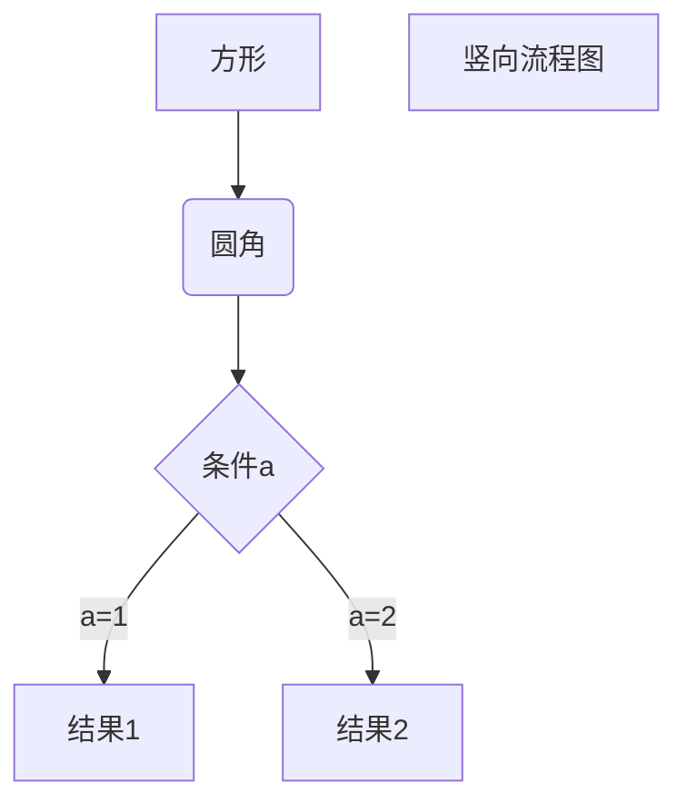
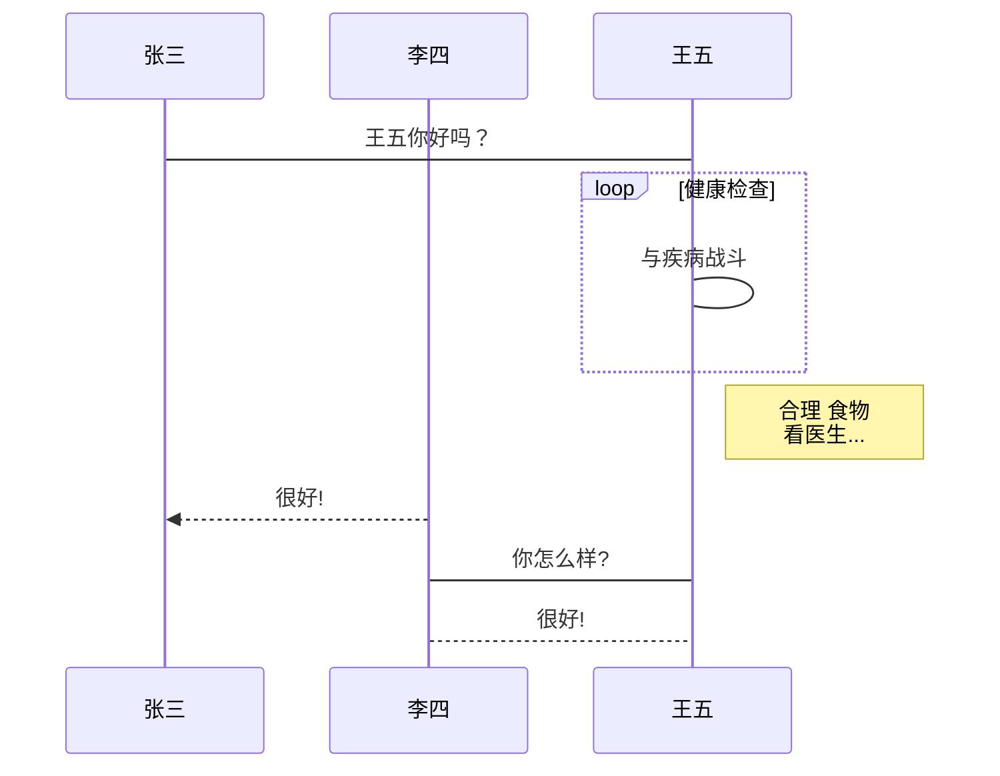
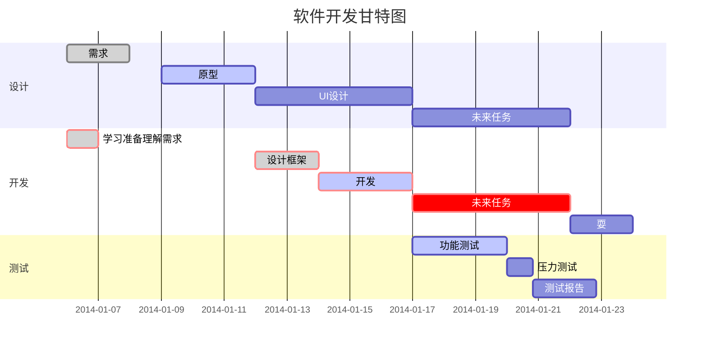

# 一级标题
## 二级标题
### 三级标题
#### 四级标题
##### 五级标题
###### 六级标题

*斜体文本*
**粗体文本**
***粗斜体文本***

~~删除线文本~~

下划线文本[^RUNOOB]

* 列表项一
* 列表项二
* 列表项三

1. 第一项
   * 列表项一
   * 列表项二
   * 列表项三
   
2. 第二项
   - 列表项一
   - 列表项二
   - 列表项三
3. 第三项

> 根节点
>> 子节点
>>> 叶节点

<br>

<em>重点强调内容</em>

这段文本包含 <sup>上标</sup> <sub>下标</sub>

<i><b>html<b/>html斜体文本</i>

`printf()` 函数或代码块


```java
package org.penguin.project.constant;

public enum CommodityType {

  SINGLE, MANY;
}
```


[心若向阳的网站](https://www.yinghuatech.top)


|  表头   | 表头  |
|  ----  | ----  |
| 单元格  | 单元格 |
| 单元格  | 单元格 |

使用 <kbd>Ctrl</kbd>+<kbd>Alt</kbd>+<kbd>Del</kbd> 重启电脑





```flow
st=>start: 开始框
op=>operation: 处理框
cond=>condition: 判断框(是或否?)
sub1=>subroutine: 子流程
io=>inputoutput: 输入输出框
e=>end: 结束框
st->op->cond
cond(yes)->io->e
cond(no)->sub1(right)->op
```

```flow
st=>start: 开始框
op=>operation: 处理框
cond=>condition: 判断框(是或否?)
sub1=>subroutine: 子流程
io=>inputoutput: 输入输出框
e=>end: 结束框
st(right)->op(right)->cond
cond(yes)->io(bottom)->e
cond(no)->sub1(right)->op
```

```sequence
对象A->对象B: 对象B你好吗?（请求）
Note right of 对象B: 对象B的描述
Note left of 对象A: 对象A的描述(提示)
对象B-->对象A: 我很好(响应)
对象A->对象B: 你真的好吗？
```

```sequence
Title: 标题：复杂使用
对象A->对象B: 对象B你好吗?（请求）
Note right of 对象B: 对象B的描述
Note left of 对象A: 对象A的描述(提示)
对象B-->对象A: 我很好(响应)
对象B->小三: 你好吗
小三-->>对象A: 对象B找我了
对象A->对象B: 你真的好吗？
Note over 小三,对象B: 我们是朋友
participant C
Note right of C: 没人陪我玩
```






$$
\mathbf{V}_1 \times \mathbf{V}_2 =  \begin{vmatrix} 
\mathbf{i} & \mathbf{j} & \mathbf{k} \\
\frac{\partial X}{\partial u} &  \frac{\partial Y}{\partial u} & 0 \\
\frac{\partial X}{\partial v} &  \frac{\partial Y}{\partial v} & 0 \\
\end{vmatrix}
${$tep1}{\style{visibility:hidden}{(x+1)(x+1)}}
$$

***

**main contain: Spring boot2.2 + MyBatis + MySQL + graphql + WebSocket + Redis + Spring security + JWT.**

Open application.properties, you can change the database infos.

Open main.graphqls, you can change the query and the mutation infos.

After clone the codes, and modify the database root's password, then you can run it. 

cd graphqlServer

mvn spring-boot:run

1. Create the table.

CREATE TABLE `users` (
  `id` varchar(36) NOT NULL,
  `fullname` varchar(10) DEFAULT NULL,
  `username` varchar(20) NOT NULL,
  `encrypted_password` varchar(60) DEFAULT NULL,
  `mobile` varchar(11) NOT NULL,
  `email` varchar(45) NOT NULL,
  `gender` int(1) DEFAULT '0',
  `description` varchar(200) DEFAULT NULL,
  `create_time` datetime DEFAULT CURRENT_TIMESTAMP,
  `update_time` datetime DEFAULT CURRENT_TIMESTAMP,
  PRIMARY KEY (`id`),
  UNIQUE KEY `USERNAME_USERS_UNIQUE` (`username`),
  UNIQUE KEY `MOBILE_USERS_UNIQUE` (`mobile`),
  UNIQUE KEY `EMAIL_USERS_UNIQUE` (`email`)
) ENGINE=InnoDB DEFAULT CHARSET=utf8;

CREATE TABLE `roles` (
  `id` varchar(36) NOT NULL,
  `name` varchar(45) DEFAULT NULL,
  `description` varchar(200) DEFAULT NULL,
  `create_time` datetime DEFAULT CURRENT_TIMESTAMP,
  `update_time` datetime DEFAULT CURRENT_TIMESTAMP,
  PRIMARY KEY (`id`),
  UNIQUE KEY `NAME_ROLES_UNIQUE` (`name`)
) ENGINE=InnoDB DEFAULT CHARSET=utf8;

CREATE TABLE `users_roles` (
  `id` int(11) NOT NULL AUTO_INCREMENT,
  `user_id` varchar(36) NOT NULL,
  `role_id` varchar(36) NOT NULL,
  `enabled` bit(1) DEFAULT b'1',
  `create_time` datetime DEFAULT CURRENT_TIMESTAMP,
  `update_time` datetime DEFAULT CURRENT_TIMESTAMP,
  PRIMARY KEY (`id`)
) ENGINE=InnoDB DEFAULT CHARSET=utf8;

2. Initialize data.

INSERT INTO `users` VALUES ('841f037c-258a-11ea-9114-1859784c178e','管理员','admin','$2a$10$xk.I7WJvhvz3O8.CAvFQIuKxhpMjxya275pKKh4KWn//6z0kTINIW','13211111111','admin@penguin.org',1,NULL,'2019-12-23 21:45:44','2019-12-23 21:45:44'),('841f07b4-258a-11ea-9114-1859784c178e','测试员','test','$2a$10$vQBgPPmVxL15wb5lBxX4D.7pZCNmXoVv0fO8InmUnn/n2JtOnwR3i','13211111112','test@penguin.org',1,NULL,'2019-12-23 21:45:44','2019-12-23 21:45:44'),('841f0a02-258a-11ea-9114-1859784c178e','部门经理','manager','$2a$06$AzzbwgOgKaZL65il94n9MOrrGUTb2LqZi95AWei4y8zrocYS7Gdky','13211111113','manager@penguin.org',1,NULL,'2019-12-23 21:45:44','2019-12-23 21:45:44');
INSERT INTO `roles` VALUES ('feb372c6-258a-11ea-9114-1859784c178e','USER',NULL,'2019-12-23 21:49:09','2019-12-23 21:49:09'),('feb3995e-258a-11ea-9114-1859784c178e','MANAGER',NULL,'2019-12-23 21:49:09','2019-12-23 21:49:09'),('feb39ad0-258a-11ea-9114-1859784c178e','ADMIN',NULL,'2019-12-23 21:49:09','2019-12-23 21:49:09');
INSERT INTO `users_roles` VALUES (1,'841f037c-258a-11ea-9114-1859784c178e','feb39ad0-258a-11ea-9114-1859784c178e',_binary '','2019-12-23 22:21:57','2019-12-23 22:21:57'),(2,'841f0a02-258a-11ea-9114-1859784c178e','feb3995e-258a-11ea-9114-1859784c178e',_binary '','2019-12-23 22:21:57','2019-12-23 22:21:57'),(3,'841f07b4-258a-11ea-9114-1859784c178e','feb372c6-258a-11ea-9114-1859784c178e',_binary '','2019-12-23 22:21:57','2019-12-23 22:21:57'),(4,'841f037c-258a-11ea-9114-1859784c178e','feb372c6-258a-11ea-9114-1859784c178e',_binary '','2019-12-23 22:29:10','2019-12-23 22:29:10');

uuid()
password('12345678') -> md5('12345678')

3. test query and mutation functions using iql

http://localhost:8080/graphiql

If you don't test them using iql, please call hql API.

a. get all users.

{
  listUsers {
    id
    fullname
    username
    gender
    createTime
  }
}

b. query user by unique username

{
  getUser(username:"admin") {
    id
    fullname
    gender
    createTime
  }
}

c. Create a new user.

mutation {
  createUser({fullname: "Employee10", username: "employee10", email: "employee10@penguin.org", mobile: "13211111114"}) {
    id
    fullname
  }
}

**Websocket relative terms**

**STOMP** stands for Simple Text Oriented Messaging Protocol. It is a messaging protocol that defines the format and rules for data exchange.
Why do we need STOMP? Well, WebSocket is just a communication protocol. It doesn’t define things like - How to send a message only to users who are subscribed to a particular topic, or how to send a message to a particular user. We need STOMP for these functionalities.

**SockJS** is a browser JavaScript library that provides a WebSocket-like object. SockJS gives you a coherent, cross-browser, Javascript API which creates a low latency, full duplex, cross-domain communication channel between the browser and the web server.
Under the hood, SockJS tries to use native WebSockets first. If that fails it can use a variety of browser-specific transport protocols and presents them through WebSocket-like abstractions.

**Spring WebSocket** is the Spring module that enables WebSocket-style messaging support. As Spring WebSocket’s documentation states, the WebSocket protocol defines an important new capability for web applications: full-duplex, two-way communication between client and server.

**Notification**
https://jira.spring.io/browse/DATAREST-933. It can't run with spring web(webmvc).

**Redis**
 brew services start redis
 redis-server /usr/local/etc/redis.conf
/usr/local/Cellar/redis/5.0.7

# set access password
redis-cli

CONFIG SET requirepass "redissuperman"

https://redis.io/commands
https://redis.io/documentation
https://spring.io/projects/spring-data-redis
https://docs.spring.io/spring-data/data-redis/docs/current/reference/html/#reference

Setting up the Redis Cache on your machine
Writing a Spring Boot Application
Use Spring’s Integrated @Cacheable Annotation to cache results of method invocations using Spring Data Redis
Gain more fine granular control by using the other available Annotations
Create dynamic CacheKeys: Cache depending on the input parameters of our methods
Define after what time (TTL=time-to-live) our cached Entries are not valid anymore
Define different TTLs

**grpc**

https://github.com/yidongnan/grpc-spring-boot-starter
https://github.com/LogNet/grpc-spring-boot-starter
